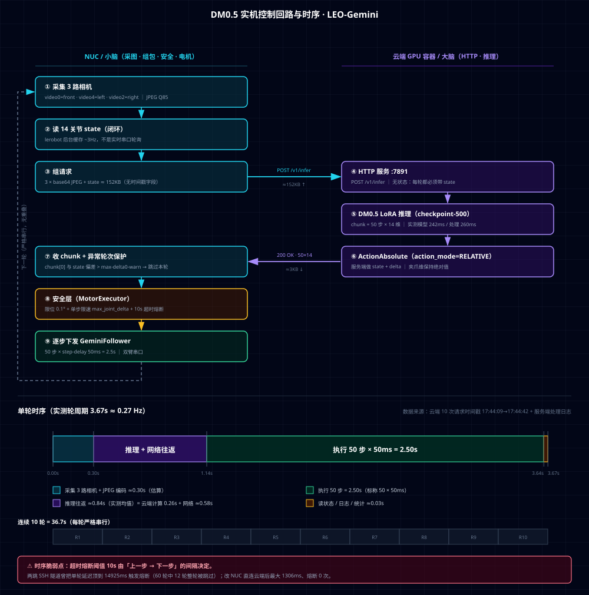
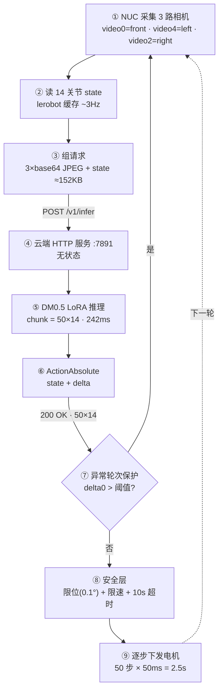
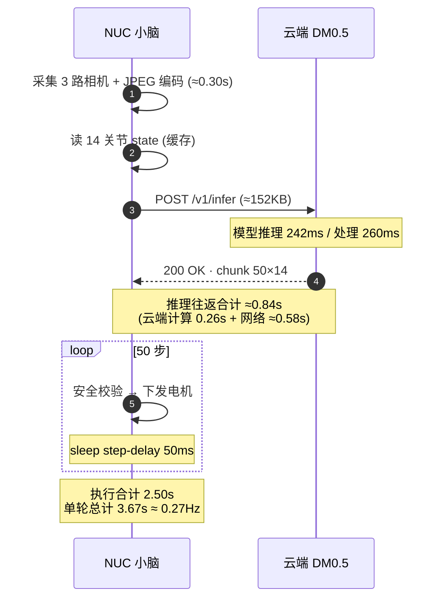

# DM0.5 实机控制逻辑、时序与后续测试方案

> 日期：2026-09-28
> 配套代码：`codes/step7_gemini/dm05/`
> 关联文档：[DM05_REALROBOT_DEBUG_NOTES.md](DM05_REALROBOT_DEBUG_NOTES.md)（根因分析）、
> [DM05_DEPLOYMENT_HANDOFF.md](DM05_DEPLOYMENT_HANDOFF.md)（部署流程）
> 流程图：[figs/dm05-control-loop.svg](../figs/dm05-control-loop.svg)

---

## 一、操作回顾

### 1.1 时间线

| 时间 | 做了什么 | 结果 |
|---|---|---|
| 09-23 | 云端容器部署 DM0.5（OpenDM），打 3 个补丁绕开 flash-attn | 模型可加载，LoRA 可训练 |
| 09-23 | v1 数据集（旧采集环境）转 DM05 格式，LoRA 训练 500 步 | 平滑 loss 0.0318 |
| 09-23 | 搭 NUC 控制器（采图 + 读关节 + HTTP + 安全层 + 电机） | 首次实机推理跑通，但抓取不稳定 |
| 09-23 晚 | 重新采集数据集（与部署环境一致） | `grasp_two_obj_new`，30 集 / 25843 帧 / 608M |
| 09-24 | v2 数据集转换 + LoRA 500 步训练 | 平滑 loss **0.0218（−32%）** |
| 09-24 | 逐项消融：图像域、front 裁剪、horizon、限位、时间戳、训练充分性 | **全部排除** |
| 09-24 | 定位根因：起始位姿落在训练分布外（OOD） | `right_shoulder` 89.4° vs 104.7° |
| 09-24 | 实现「启动整机归位到训练初始位姿」 | 14 关节残余偏差 **≤1.5°**，22.8s |
| 09-24 | 带归位的 LIVE 测试 | 跑到第 19 轮，**NUC 突然整体掉线** |
| 09-24 18:02 | 代码 + 文档推到 `github.com/howe12/vla-course`（`gemini` 分支） | 提交 `51a0a0d` |
| 09-28 | 复查环境 | NUC 仍不可达；**云容器已被回收**（`:30145` Connection refused） |

### 1.2 结论

**训练侧不是瓶颈。** v2 数据与实机图像域高度一致（front HSV 相关性 **0.963**，v1 仅 0.311），
500 步后模型在训练分布内的拟合已经很准（h=0 时 MAE 0.71°，夹爪稳态 0.12–0.63°）。

**瓶颈是部署时的初始条件。** 训练数据首帧 `right_shoulder ≈ 89.4°`（`[85,90)` 占 61.44%），
机器人断电静止位是 `104.7°`（训练中仅占 0.07%）。模型在 OOD 状态下把右臂驱动得乱走
（摆幅 124.6°），形成训练数据中不存在的「左臂已到抓取位 + 右臂仍在动」组合，
于是连左臂的动作方向也错了。而训练数据里**右臂在抓取全程几乎锁死**
（`right_shoulder` 88.9±0.1、`right_elbow` −87.6±0.2），所以右臂一乱就全盘崩。

归位后：`delta0` 最大偏差 −32%、安全告警 −22%、右臂摆幅 −31%、抓取位 7 维对齐距离 −40%。

**尚未取得决定性验证**：归位后抓取是否真能成功。测试在 NUC 掉线时中断，
需要恢复环境后重跑。

### 1.3 本轮修掉的问题清单

| # | 问题 | 症状 | 修复 |
|---|---|---|---|
| 1 | 限位单位 bug | 目标全被夹到 ±10°，假的「变化量 740 超限」 | 按 **0.1°** 单位重写 `SAFE_LIMITS` |
| 2 | 相机左右接反 | 左臂按右视角动作 | `CAMERA_MAP = [(0,front),(4,left),(2,right)]` |
| 3 | 归位串行 | 90s 只让 4 个关节动了不到 3° | 改为**全关节同步分段推进** |
| 4 | 状态缓存 3 Hz | 渐进式下发反复重发同一目标 | 分段直发 + 等本段到位 |
| 5 | 两跳隧道延迟 | 尖峰 14925ms → 熔断，60 轮中 12 轮被跳过 | NUC **直连**云端：最大 1306ms，熔断 0 |
| 6 | 夹爪弹簧复位 | 断开扭矩后夹爪弹回 −80°（训练中仅 0.13%） | 每次重连后在同一进程内先归位 |

---

## 二、当前控制逻辑

### 2.1 分层

```
motor_executor_live_dm05.py      主循环：采集 → 推理 → 执行 → 循环
├── brain_http_client.py         HTTP 契约、图像编码、front 裁剪、缺相机补灰图
├── motor_executor.py            安全层：限位、限速、超时熔断、首次动作跳过
└── LiveMotorController          设备层：lerobot GeminiFollower、状态读取、归位、开爪
```

### 2.2 数据契约

| 方向 | 内容 | 说明 |
|---|---|---|
| NUC → 云端 | `3 × base64 JPEG` + `state`(14 维) + `instruction` | ≈152KB，**无时间戳字段** |
| 云端 → NUC | `actions` = 50 × 14 绝对目标位置 | chunk=50 |
| 语义 | `action_mode = RELATIVE` | 服务端 `ActionAbsolute` 做 `state + delta`；**夹爪维保持绝对值** |

> ⚠️ 因为服务端要拿 `state` 做 `state + delta`，**传入的 `state` 直接决定最终动作**。
> 传错 `state`（比如读到了旧缓存）会算出完全错误的绝对位置 —— 这也是为什么
> 「起始位姿正确」比「图像更清晰」重要得多。

### 2.3 流程图





### 2.4 时序



### 2.5 实测时序数字

| 阶段 | 耗时 | 来源 |
|---|---|---|
| 采集 3 路相机 + JPEG 编码 | ≈0.30s | 估算（日志 `[采集]`） |
| 推理往返 | **≈0.84s** | 实测均值（直连隧道） |
| ├ 云端计算 | **0.258–0.263s** | 服务端日志 `model_latency_ms 240–245` |
| └ 网络 + 组包/解包 | ≈0.58s | 差值 |
| 执行 50 步 | **2.50s** | 标称 50 × `step-delay 0.05` |
| 读状态 / 日志 / 统计 | ≈0.03s | 估算 |
| **单轮合计** | **3.67s** | 实测：10 次请求间隔 3.59–3.74s |

即控制频率约 **0.27 Hz**，一个 50 步 chunk 对应 2.5s 的执行，
**开环执行时间远大于推理时间**（2.5s vs 0.84s）—— 这是当前架构的主要时序特征。

### 2.6 异常分支与熔断

| 分支 | 触发条件 | 行为 |
|---|---|---|
| 异常轮次保护 | `max(abs(chunk[0] − state)) > --max-delta0-warn` | 记录日志，**跳过本轮执行**，直接进入下一轮 |
| 动作超时熔断 | 相邻两次 `execute_action_chunk` 间隔 > **10s** | 该步跳过（`action_count` 不变） |
| 关节越界 | 目标超出 `SAFE_LIMITS` | 截断到边界并告警 |
| 单步超速 | `|目标 − 上一步| > max_joint_delta` | 截断到 `上一步 ± max_joint_delta` |
| 峰值速度告警 | 本轮行程 / 耗时 > `--max-speed-warn` | 仅告警，不拦截 |
| 采集失败 | `cap.read()` 返回 False | 该路用灰图占位继续 |
| 相机不足 3 路 | `len(caps) < 3` | 告警，缺失路用灰图 |

> **10s 超时阈值是最脆弱的环节**：它衡量的是「上一步 → 下一步」的间隔，
> 只要一轮的总耗时（采集 + 推理 + 执行）超过 10s 就会熔断。
> 两跳 SSH 隧道时代延迟尖峰 14925ms → 60 轮里 12 轮被整轮跳过。

---

## 三、后续测试方案

### 阶段 0：环境恢复（当前阻塞点）

| 项 | 状态 | 动作 |
|---|---|---|
| 云端容器 | ❌ `:30145` Connection refused | 重新申请/启动 GPU 容器 |
| 数据盘 `/root/gpufree-data` | ❓ 待确认 | 检查 `user_checkpoints/leo_lora_new/checkpoint-500`、`datasets/leo_gemini_new` 是否还在 |
| 系统盘 `/root/opendm` | ❌ 大概率丢失（overlay） | 按 [DM05_CLOUD_PATCH_BACKUP.md](DM05_CLOUD_PATCH_BACKUP.md) 重打 3 个补丁 + 装环境 |
| 推理服务 `:7891` | ❌ 未运行 | 用 `checkpoint-500` 启动，`image-prompts Head 'Left wrist' 'Right wrist'` |
| NUC `192.168.100.146` | ❌ 不可达 | **现场检查供电/开机**；确认 `/dev/ttyACM_left_follower`、`/dev/ttyACM_right_follower` 与 video0/4/2 |
| SSH 隧道 | ❌ | NUC 直连云端（把 NUC 的 `id_rsa.pub` 加入云端 `authorized_keys`），**不要两跳** |

> **NUC 掉线原因待查**。建议这次测试时在 NUC 上另开一个 `dmesg -w` / `journalctl -f`
> 会话并把日志**实时同步到本机**（`ssh ... 'tail -f log' | tee local.log`），
> 这样即使 NUC 再次消失也不会丢现场。

### 阶段 1：链路验证（不驱动电机）

```bash
python3 dry_run_dm05.py                       # DRY_RUN，验证 HTTP 契约与形状
```

- 看 `[采集]` 耗时、`[推理] 总 Xms (云端 Yms)`；
- 判定：单轮总耗时 < 10s 且**稳定**，云端耗时 200–300ms。

### 阶段 2：归位验证（驱动电机，但不推理）

```bash
python3 probe_home.py 5.0
```

- 判定：14 关节**残余偏差 ≤ 1.5°**，耗时 20–30s，段数约 19–23；
- 连跑 3 次确认重复性（每次重连夹爪都会弹回 −80°，属预期）。

### 阶段 3：单轮小步（新步骤，必做）

```bash
python3 motor_executor_live_dm05.py \
    --live --home-mode initial --rounds 1 \
    --max-joint-delta 5 --step-delay 0.05 --max-delta0-warn 20 --flush-camera
```

- **只跑 1 轮**，人站急停旁；
- 判定：`[诊断] delta0 max < 3°`、`[安全] 峰值速度 < 15°/s`、
  左臂朝抓取位（`L_shldr → −35.7`、`L_elbow → 39.0`、`L_wroll → 55.6`）推进。

### 阶段 4：短程闭环（3–5 轮）

- 重点看**右臂是否保持不动**（`R_shldr ≈ 89`、`R_elbow ≈ −87.6`）。
  这是判定「起始位姿修复是否真正生效」的最直接指标。
- 若右臂仍在动 → 说明 OOD 问题没解决干净，回到 `DM05_REALROBOT_DEBUG_NOTES.md` 复查。

### 阶段 5：完整任务（30 轮）

- 人工记录：**是否抓住、第几轮抓住、夹爪闭合时刻**；
- 同时保存完整日志（并实时同步到本机）。

### 阶段 6：对照实验（按需）

| 目的 | 做法 |
|---|---|
| 确认归位的净效果 | 同一次上电状态下做 `--home-mode off` 的 A/B |
| 收敛残余误差（`L_shldr` 差 32.6°、`L_elbow` 差 28.2°） | 复用同一 `output_dir` 续训 v2 到 1000 / 2000 步（`num-train-steps` 填**累计**值） |
| 复查 `L_wrist_flex` 过冲（−101.0 vs 目标 −74.6） | 看是否贴 `SAFE_LIMITS.wrist_flex` 下限（−101.0°） |
| 提高闭环频率 | 减小 `--step-delay`（50ms → 33ms）或缩短 chunk 执行步数，需重新评估安全限速 |

### 3.1 安全红线（每次实机都要守）

- ISO/TS 15066 协作机器人末端限速 **0.25 m/s**；
  `--max-joint-delta 5` ≈ 0.12 m/s（调试推荐），`15` ≈ 0.43 m/s **已超限**。
- 首次运行一律 `--max-joint-delta 5`，确认稳定后再逐级放宽。
- `--home-mode initial` 会驱动**全部 14 个关节**，启动前确认活动范围内无障碍物、急停可达。
- 训练数据手臂关节速度 95 分位约 60–63 °/s，夹爪闭合速度中位数 9.6 °/s ——
  默认 40 °/s 比夹爪在训练数据里的闭合速度还快 4 倍。

---

## 四、已知遗留问题

1. **归位后抓取成功率未验证**（测试中断，P0）。
2. 抓取位残余误差：`L_shldr` 32.6°、`L_elbow` 28.2°（策略本身误差，非归位问题）。
3. `L_wrist_flex` 过冲 26.4°。
4. NUC 掉线根因未知（供电？USB 串口被扰动？WiFi 掉了？）。
5. 开环执行 2.5s 占单轮 68%，chunk 内部无中途重规划；
   若抓取对精度要求更高，需要评估缩短执行步数换取闭环频率。
